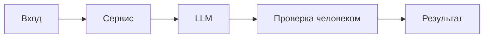

# ADR: решение для первого рабочего сценария

- Статус: proposed
- Дата: 2026-09-09
- Ответственные: Команда сервиса ревью; владелец продукта

## Контекст

TRAINING_PR.diff добавляет метод `review` в `ReviewService` и эндпоинт `/api/reviews`, пересылающий diff во внешний LLM и возвращающий `{"comment": answer}`. Это создаёт риски по SEC-1, API-1, REL-1 и несоответствие OUT-1. OBS-1 требует ограниченного логирования.

## Решение

- Для первого инкремента согласовать требования: SEC-1 (редактирование секретов), API-1 (413 >20k), REL-1 (таймаут 10с и контролируемый ответ), OUT-1 (структурированный ответ), OBS-1 (минимальные логи). Реализацию кода в этом инкременте не выполняем (SCOPE-1): готовим артефакты, тесты и критерии.

## Рассмотренные альтернативы

| Альтернатива | Почему не выбрали сейчас |
|---|---|
| Сразу реализовать логику в коде | Противоречит SCOPE-1 и задачам практики |
| Игнорировать SEC-1/API-1/REL-1 | Неприемлемые риски безопасности и надёжности |
| Делегировать весь контроль клиентам | Необоснованная нагрузка и риск рассинхронизации контрактов |

## Последствия и главный риск

- Положительные последствия:
  - Соблюдение SEC-1/API-1/REL-1/OUT-1: предсказуемый контракт, безопасность и контролируемые ошибки.
  - Повышение надёжности: таймаут внешнего LLM и обработка ошибок вместо подвисаний.
  - Улучшение качества ревью: структурированные summary/risks/checks, не более 3 подтверждённых рисков (QA-1).
- Ограничения:
  - Дополнительные усилия на редактирование секретов и валидацию входа; базовая наблюдаемость по OBS-1.
  - Ожидаемое поведение 413 при больших diff (>20k) может требовать коммуникации с потребителями API.
  - Запрет логирования содержимого diff/ответа ограничивает диагностику и требует аккуратных метрик.
- Главный риск:
  - Некорректное редактирование секретов (утечка либо избыточное скрытие) и деградация UX из-за частых 413.
- Как проверим риск:
  - Юнит-тесты SEC-1 с фикстурами token/password/private key: в prompt отсутствуют оригинальные значения.
  - Интеграционный тест API-1: diff > 20000 символов -> HTTP 413, вызов LLM не происходит.
  - Интеграционный тест REL-1: симуляция таймаута LLM -> контролируемый ответ без падения схемы.
  - E2E OUT-1: структура ответа содержит summary, risks<=3 с file/line/evidence/risk и checks.

## Архитектурная схема

## Как использовали AI

- Для чего: зафиксировать решение и границы первого инкремента.
- Тип промпта: master prompt (P1-03).
- Строка в [`prompts.md`](prompts.md): P1-03.
- Что проверили и исправили сами: источники контекста из diff; соответствие правилам; отсутствие собственных правил и действий approve/merge/edit.
