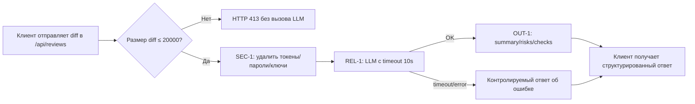

# Анализ процесса: AS IS и TO BE

## AS IS

Сейчас API `/api/reviews` принимает `payload["diff"]` и напрямую передаёт его во внешний LLM без редактирования секретов, ограничений длины и таймаута. Возвращается словарь с ключом `comment`.

- Участники: Клиент (внутренний сервис/инженер), API (`app/api.py`), ReviewService (`app/review_service.py`), внешний LLM.
- Ручные операции: интерпретация ответа LLM человеком вне сервиса.
- Точки потери качества: возможная утечка секретов (SEC-1), отсутствие отказоустойчивости на больших diff (API-1) и при зависании LLM (REL-1), несоответствие контракта OUT-1, отсутствие валидации входа и телеметрии (OBS-1: логируется не то, что требуется; сейчас вообще не описано).

## TO BE

Минимально изменённый процесс, соблюдающий SEC-1, API-1, REL-1, OUT-1, OBS-1. Сервис не пишет код и ничего не делает в GitHub (SCOPE-1) — он только советует и формирует структурированный ответ.

## Разница

| Что меняется | AS IS | TO BE | Как проверим изменение |
|---|---|---|---|
| Обработка размера diff | Нет ограничения | 413 при >20k и без вызова LLM | Интеграционный тест API-1 |
| Редактирование секретов | Нет | Секреты удаляются из prompt | Юнит-тест SEC-1 с фикстурами |
| Таймаут и ошибки LLM | Нет | Таймаут 10с и контролируемый ответ | Интеграционный тест REL-1 |
| Формат ответа | `{\"comment\": ...}` | OUT-1: `summary`, `risks[]`, `checks[]` | E2E тест OUT-1 |
| Логи | Не определены | Только `request_id`, длительность, статус | Осмотр логов на тестовом окружении |

## Как использовали AI

- Для чего: оформить AS IS/TO BE и критерии проверки первого инкремента.
- Тип промпта: master prompt (P1-03).
- Строка в [`prompts.md`](prompts.md): P1-03.
- Что проверили и исправили сами: соотнесли изменения с TRAINING_PR.diff и правилами; не добавляли собственных правил; обозначили неизвестное как «Требуется решение команды».
