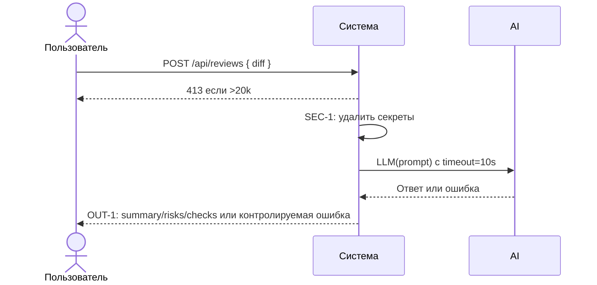

# Use cases и user stories

## Первый рабочий сценарий

Когда внутренний клиент отправляет diff в `/api/reviews`, система проверяет размер (>20k — 413), редактирует секреты (SEC-1), вызывает внешний LLM с таймаутом 10с (REL-1) и возвращает структурированный ответ по OUT-1; пользователь получает краткое summary, до 3 рисков с evidence и список проверок.

Не входит в этот сценарий:

- Любые действия approve/merge/edit; изменения кода; деплой; операции в GitHub.

## Use case

| Поле | Значение |
|---|---|
| Актор | Внутренний сервис/инженер |
| Триггер | POST `/api/reviews` с полем `diff` |
| Предусловия | Доступность сервиса; diff предоставлен строкой |
| Основной результат | OUT-1-структура: `summary`, `risks[]≤3`, `checks[]` |
| Ошибка или отказ | 413 при diff > 20000; контролируемый ответ при таймауте LLM |



## User stories и acceptance criteria

```gherkin
Feature:

  Scenario: Позитивный ответ OUT-1
    Given доступен эндпоинт POST /api/reviews
    And diff длиной < 20000 символов
    When я отправляю diff без секретов
    Then я получаю JSON с полями summary, risks (не более 3) и checks

  Scenario: Граничный размер diff
    Given доступен эндпоинт POST /api/reviews
    And diff длиной > 20000 символов
    When я отправляю такой diff
    Then я получаю HTTP 413 и вызов внешнего LLM не происходит

  Scenario: Таймаут внешнего LLM
    Given доступен эндпоинт POST /api/reviews
    And внешний LLM отвечает дольше 10 секунд
    When я отправляю валидный diff
    Then сервис возвращает контролируемый ответ об ошибке без падения схемы
```

## Как использовали AI

- Для чего: описать сценарий, use case и критерии приёмки для первого инкремента.
- Тип промпта: master prompt (P1-03).
- Строка в [`prompts.md`](prompts.md): P1-03.
- Что проверили и исправили сами: соответствие OUT-1/SEC-1/API-1/REL-1; отсутствие действий approve/merge/edit; формулировки критериев воспроизводимы.
