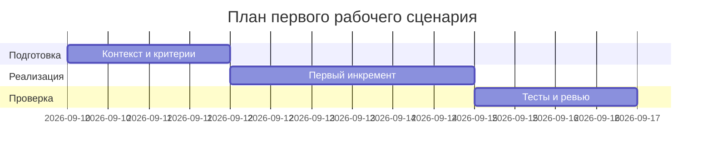

# План поставки

## Инкременты и ответственность

| Инкремент | Наблюдаемый результат | Что делает человек | Что делает AI или субагент | Проверка | Зависимости |
|---|---|---|---|---|---|
| 1 | Сформированы артефакты Практики 1 (P1-03) | Утверждает содержание артефактов, уточняет неизвестное | Генерирует черновики документов | Соответствие quality_gates | TRAINING_PR.diff и правила |
| 2 | Тестовые сценарии описаны | Утверждает набор проверок | Предлагает тест-кейсы (unit/integration/e2e/load) | Полнота по SEC-1, API-1, REL-1, OUT-1 | Инкремент 1 |
| 3 | План внедрения согласован | Утверждает сроки и ресурсы | Обновляет диаграмму Ганта и зависимости | Согласование командой | Инкременты 1-2 |

## Диаграмма Ганта



Замените даты и задачи на свой план.

## Как использовали AI

- Для чего: зафиксировать план поставки первого инкремента.
- Тип промпта: master prompt (P1-03).
- Строка в [`prompts.md`](prompts.md): P1-03.
- Что проверили и исправили сами: наличие блока ```mermaid, связность инкрементов, проверки по правилам, отсутствие лишних действий.
